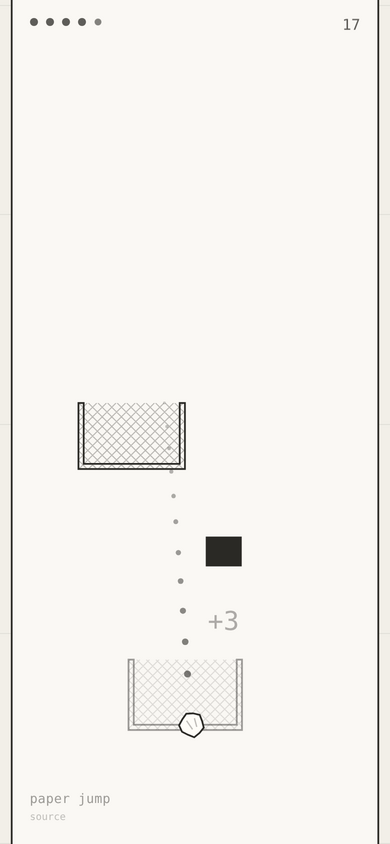
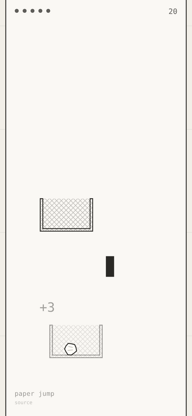
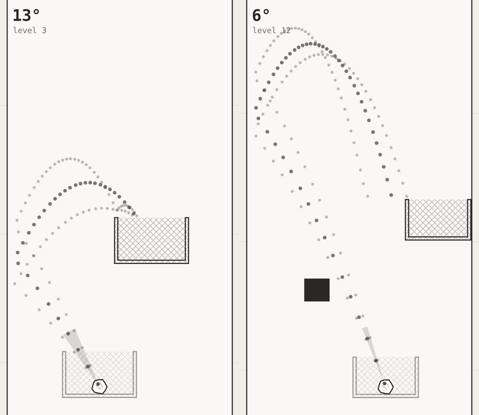
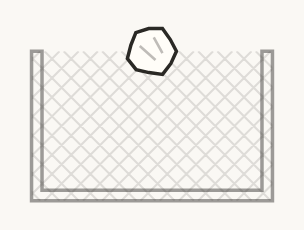
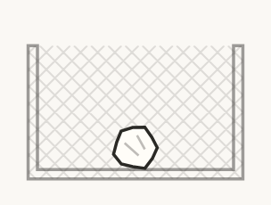

# Process overview

## What I built

**paper jump** — a paper-toss + bouncing ball game.

| aiming — the arc is drawn for you, and stops at the first thing it touches | landed — and the bin it landed in is now the launcher |
| --- | --- |
|  |  |

## The moments that mattered

**Measuring difficulty instead of tuning it.** A reachability test failed on
level 17 — not a bad seed: the constants ran the gap to 480u against a maximum
rise of 560u, leaving nine working shots in 51,300 launches. The obvious move
was to nudge numbers until green; what came back instead was a probe, and
keeping it was the call. Its first metric was wrong — raw solution density
punishes a near-overhead bin, the easiest shot a person can take. **Aim
tolerance**, the widest unbroken band of launch angles that still scores, reads
straight against a thumb's 3–5°. Every constant has moved on that reading
since: the retune that fixed 17, then a requested 20% ease measured at
13.0° → 16.9° mean, 23%. It also found what feel would not — the floor moves on
obstacle count, not gap or bin width — and it stayed, as `pnpm probe` behind a
floor the suite asserts.
[`428d3d4`](https://github.com/comp4020-agentic-coding-studio/comp4020-crit5-rangermix/commit/428d3d4), [`1aad0f2`](https://github.com/comp4020-agentic-coding-studio/comp4020-crit5-rangermix/commit/1aad0f2)

| what the probe reads, drawn on the game's own art: the widest unbroken band of launch angles that still scores, and the paths its two edges and its middle actually fly |
| --- |
|  |

**The first player who wasn't me.** I gave it to my wife and watched a whole
run without narrating; one sitting produced three things no test had flagged.
The bounces sounded like a doorbell — oscillators, when a crumpled sheet on
wire mesh is broadband rustle, so every impact now reads a random slice of a
noise buffer through a swept bandpass. A dead shot took too long to call, and
the obvious fix, a shorter rest timer, would have cut live shots short: what
works is a rule, that paper below the rim it left and still falling can never
climb back on a 0.32-restitution bounce. Over 8,580 misses, time-to-verdict
went 2.28s → 0.85s median and 8.00 → 4.35 worst. And paper should start *in*
the basket, not balanced on its rim: it now rests on the cavity floor at the
offset where it landed, so scraping in at the left edge leaves you shooting
from the left edge. Both rules have tests.
[`8f37cd0`](https://github.com/comp4020-agentic-coding-studio/comp4020-crit5-rangermix/commit/8f37cd0)

| before — balanced on the rim | after — sitting in the basket |
| --- | --- |
|  |  |

Three sensors outlast this brief: the aim-tolerance floor, the trap regression,
and an allowlist over the built page's visible text. [`5046f7c`](https://github.com/comp4020-agentic-coding-studio/comp4020-crit5-rangermix/commit/5046f7c)
