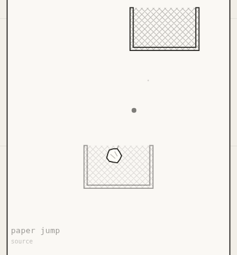
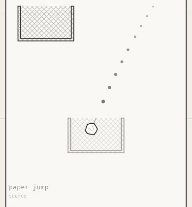

# Process overview

## What I built

**paper jump** — a paper-toss game up a narrow shaft, where the bin you land in
becomes the bin you throw from, keeping its offset from the wall and its drift.
Slingshot aiming and live walls interact: the preview shows a third of a second
and stops at the first wall, so aiming is given to you and the bounce is
earned. No instructions anywhere — the opening screen mimes the drag, then
retires itself.

## The moments that mattered

**The difficulty curve was unfair, and only an instrument could show it.** A
reachability test failed on level 17 — not a bad seed: the spec's constants ran
the gap to 480u against a maximum rise of 560u, and that level had nine working
shots in 51,300 sampled launches. Rather than nudge constants until green, I
built a probe. My first metric was wrong — raw solution density punishes a
near-overhead bin humans find easy. Measuring **aim tolerance**, the widest
unbroken band of launch angles that still scores, gave a number readable
against a thumb's 3–5° precision. Retuning produced two findings I would never
have guessed: cap obstacles at two, and cut their drift to 0.3× the bins'. The
4° floor is now a test. [`428d3d4`](https://github.com/comp4020-agentic-coding-studio/comp4020-crit5-rangermix/commit/428d3d4)

**Six preview dots is a legible arc on paper and two in the hand.** Most shots
are cut short by the target bin — exactly where you aim — so the preview
truncated at once and taught nothing. Only playing showed it. Sampling three
times as densely fixes legibility without extending the horizon, leaving the
difficulty lever untouched. [`387ee2f`](https://github.com/comp4020-agentic-coding-studio/comp4020-crit5-rangermix/commit/387ee2f)

| before — every 0.055s | after — every 0.03s |
| --- | --- |
|  |  |

Two sensors outlast this brief: that aim-tolerance floor, and an allowlist over
the built page's text, so the no-instructions rule fails the build rather than
drifting. [`5046f7c`](https://github.com/comp4020-agentic-coding-studio/comp4020-crit5-rangermix/commit/5046f7c)
